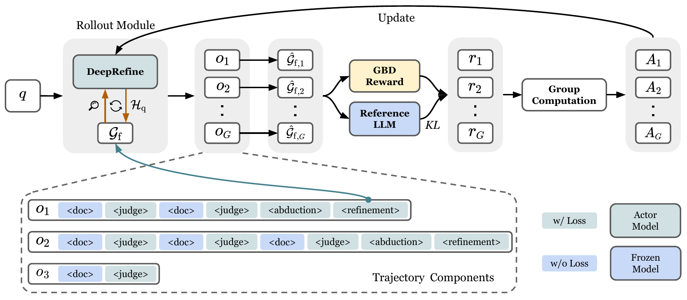

<div align="center">

# ***DeepRefine***: Agent-Compiled Knowledge Refinement via Reinforcement Learning

<p align="center">
    
</p>

[](https://arxiv.org/pdf/2605.10488)
[](https://huggingface.co/collections/HaoyuHuang2/deeprefine)
[](https://python.org)
[](LICENSE)




🤔 *Your LLM-Wiki Need to be Refined*

**DeepRefine** is a general LLM-based reasoning model for agent-compiled knowledge refinement that improves the quality of any pre-constructed knowledge bases with user queries to make it more suitable for the downstream tasks.

</div>

## News
- [2026/5/10] Static quants of DeepRefine-v1-8B, 🤗 [mradermacher/DeepRefine-v1-8B-GGUF](https://huggingface.co/mradermacher/DeepRefine-v1-8B-GGUF) has been released. Thanks to the community!


## 📊 Training Data Preprocessing

We collect the raw training data of HotpotQA from https://hotpotqa.github.io/ and then construct the data samples for RL training through the following script:

```shell
bash scripts/autograph-r1/data_prepare/hotpotqa_cons.sh
```

Or you can also access the training data under the folder `data/`.

## 🔥 GRPO Training

> ⚠️ **Configuration Reminder**: Please ensure to replace all path configurations in the following scripts with your own paths.


Update your config in `verl/third_party/autograph_r1/config.ini`.

Train $\texttt{DeepRefine-4B}$ based on $\texttt{Qwen3-4B-Instruct-2507en}$ with GRPO and GBD reward:

```shell
bash scripts/train/run_qwen3-4b_graph_refiner.sh
```

Train $\texttt{DeepRefine-8B}$ based on $\texttt{Qwen3-8B}$ with GRPO and GBD reward:

```shell
bash scripts/train/run_qwen3-8b_graph_refiner.sh
```

We have also provided our model in [HuggingFace](https://huggingface.co/collections/HaoyuHuang2/deeprefine).

## 🔍 Evaluation

> ⚠️ **Configuration Reminder**: Please ensure to replace all path configurations in the following scripts with your own paths.


There are six evaluation mode:

- Graph Retriever, no refinement.

```shell
bash scripts/eval/gr_refine_bench_no_refine.sh
```

- Graph Retriever, naive refinement (without training).

```shell
bash scripts/eval/gr_refine_bench_wo_rl.sh
```

- Graph Retriever, deeprefine.

```shell
bash scripts/eval/gr_refine_bench_rl.sh
```

- Text Retriever, no refinement.

```shell
bash scripts/eval/tr_refine_bench_no_refine.sh
```

- Text Retriever, naive refinement (without training).

```shell
bash scripts/eval/tr_refine_bench_wo_rl.sh
```

- Text Retriever, deeprefine.

```shell
bash scripts/eval/tr_refine_bench_rl.sh
```

## 📖 Citation

```python
@article{huang2026deeprefine,
  title={DeepRefine: Agent-Compiled Knowledge Refinement via Reinforcement Learning},
  author={Huang, Haoyu and Bai, Jiaxin and Liu, Shujie and Wei, Yang and Tsang, Hong Ting and Gao, Yisen and Xie, Zhongwei and Li, Yufei and Song, Yangqiu},
  journal={arXiv preprint arXiv:2605.10488},
  year={2026}
}
```
