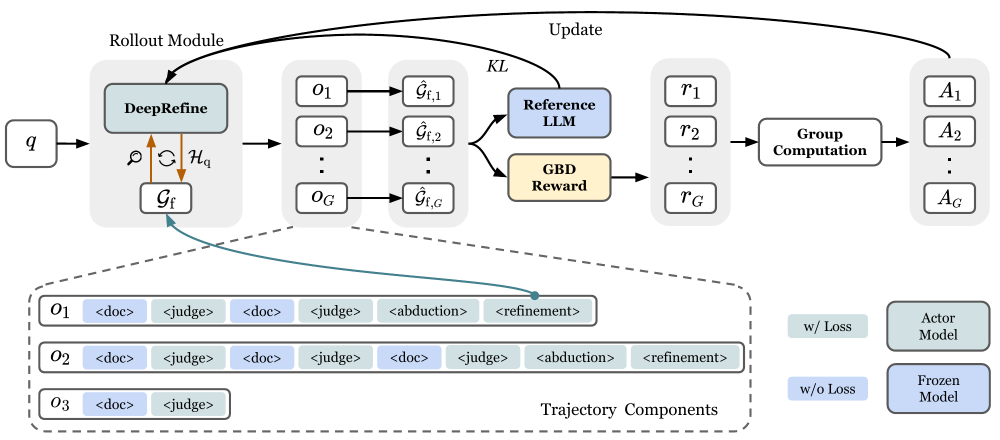

<div align="center">

# ***DeepRefine***: Agentic Knowledge Refinement via Reinforcement Learning

<p align="center">
    
</p>

[](https://arxiv.org/pdf/2605.10488)
[](https://huggingface.co/collections/HaoyuHuang2/deeprefine)
[](https://python.org)
[](LICENSE)




🤔 *Your Knowledge Base Need to be Refined*

**DeepRefine** is a reinforcement learning framework for agentic knowledge refinement that evolves the quality of any pre-constructed structured knowledge bases, e.g., knowledge graphs or LLM-Wikis, with user interaction histories to make it more suitable for the downstream tasks.

</div>

## News
- [2026/7/14] We have released our docker image 🚢[DeepRefine](https://hub.docker.com/r/hhyhuang/deeprefine). Feel free to use it to train the model directly!
- [2026/6/2] ✨[DeepRefine-Skill](https://github.com/HKUST-KnowComp/DeepRefine-Skill) has released! An agent skill to evolve the quality of LLM-Wiki (Graphify) at test time with the harness of DeepRefine.
- [2026/5/10] Static quants of DeepRefine-v1-8B, 🤗 [mradermacher/DeepRefine-v1-8B-GGUF](https://huggingface.co/mradermacher/DeepRefine-v1-8B-GGUF) has been released. Thanks to the community!

## 🪜 Environment

We provide a [Dockerfile](./Dockerfile) for a reproducible environment. You can also pull the prebuilt image directly:

```shell
docker pull hhyhuang/deeprefine
```

### Local setup

**Create `atlastune` from scratch:**

```shell
cd /path/to/DeepRefine
conda env create -f docker/atlastune_environment.yml
conda activate atlastune
pip install -e .
```

**Create the environment with pip only:**

```shell
conda create -n atlastune python=3.10 -y
conda activate atlastune
cd /path/to/DeepRefine

pip install torch==2.8.0 torchvision==0.23.0 torchaudio==2.8.0 \
  --index-url https://download.pytorch.org/whl/cu126
pip install -r docker/requirements-atlastune.txt
pip install flash-attn==2.8.3 --no-build-isolation
pip install -e .
```

`pip install -e .` registers the bundled `verl` package. For local `atlas-rag` development, use `pip install -e ./AutoSchemaKG` instead of the PyPI pin when needed.

### graphify + Cursor skill (DeepRefine-Skill)

The `/deeprefine` Cursor skill and `deeprefine` CLI live in a **separate repo** ([DeepRefine-Skill](../DeepRefine-Skill)), sibling to this one. After `atlastune` is ready:

```shell
pip install -e /path/to/DeepRefine-Skill
cd /path/to/your-kb-project && deeprefine cursor install
```

See [DeepRefine-Skill/README.md](../DeepRefine-Skill/README.md) for the full graphify workflow.

## 🚀 Quick Start Demo

We have a demo pipline [test.ipynb](./test.ipynb), in which you can have a quick overview about what DeepRefine is doing.

## 📊 Training Data Preprocessing

We collect the raw training data of HotpotQA from https://hotpotqa.github.io/ and then construct the data samples for RL training through the following script:

```shell
bash scripts/autograph-r1/data_prepare/hotpotqa_cons.sh
```

Or you can also access the training data under the folder `data/`.

## 🔥 GRPO Training

> ⚠️ **Configuration Reminder**: Please ensure to replace all path configurations in the following scripts with your own paths.


Update your config in `verl/third_party/autograph_r1/config.ini`.

Train $\texttt{DeepRefine-4B}$ based on $\texttt{Qwen3-4B-Instruct-2507en}$ with GRPO and GBD reward:

```shell
bash scripts/train/run_qwen3-4b_graph_refiner.sh
```

Train $\texttt{DeepRefine-8B}$ based on $\texttt{Qwen3-8B}$ with GRPO and GBD reward:

```shell
bash scripts/train/run_qwen3-8b_graph_refiner.sh
```

We have also provided our model in [HuggingFace](https://huggingface.co/collections/HaoyuHuang2/deeprefine).

## 🔍 Evaluation

> ⚠️ **Configuration Reminder**: Please ensure to replace all path configurations in the following scripts with your own paths.


There are six evaluation mode:

- Graph Retriever, no refinement.

```shell
bash scripts/eval/gr_refine_bench_no_refine.sh
```

- Graph Retriever, naive refinement (without training).

```shell
bash scripts/eval/gr_refine_bench_wo_rl.sh
```

- Graph Retriever, deeprefine.

```shell
bash scripts/eval/gr_refine_bench_rl.sh
```

- Text Retriever, no refinement.

```shell
bash scripts/eval/tr_refine_bench_no_refine.sh
```

- Text Retriever, naive refinement (without training).

```shell
bash scripts/eval/tr_refine_bench_wo_rl.sh
```

- Text Retriever, deeprefine.

```shell
bash scripts/eval/tr_refine_bench_rl.sh
```

## 📖 Citation

```python
@article{huang2026deeprefine,
  title={DeepRefine: Agent-Compiled Knowledge Refinement via Reinforcement Learning},
  author={Huang, Haoyu and Bai, Jiaxin and Liu, Shujie and Wei, Yang and Tsang, Hong Ting and Gao, Yisen and Xie, Zhongwei and Li, Yufei and Song, Yangqiu},
  journal={arXiv preprint arXiv:2605.10488},
  year={2026}
}
```
